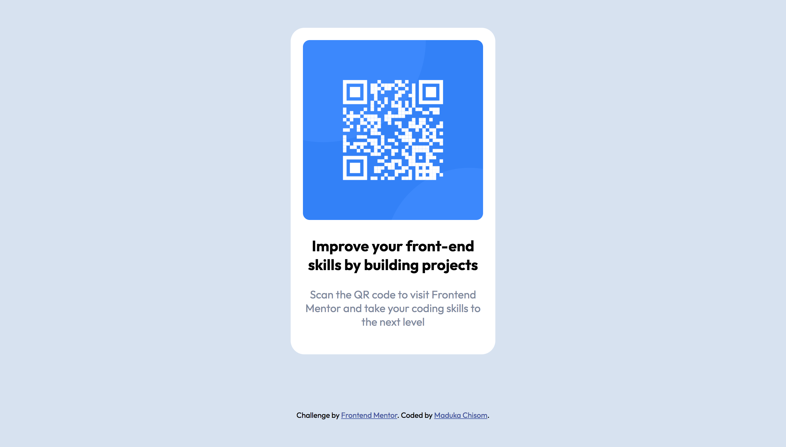

# Frontend Mentor - QR code component solution

This is a solution to the [QR code component challenge on Frontend Mentor](https://www.frontendmentor.io/challenges/qr-code-component-iux_sIO_H). Frontend Mentor challenges help you improve your coding skills by building realistic projects.

## Table of contents

- [Overview](#overview)
  - [Screenshot](#screenshot)
  - [Links](#links)
- [My process](#my-process)
  - [Built with](#built-with)
  - [What I learned](#what-i-learned)
  - [Continued development](#continued-development)
  - [Useful resources](#useful-resources)
- [Author](#author)
- [Acknowledgments](#acknowledgments)

**Note: Delete this note and update the table of contents based on what sections you keep.**

## Overview

The QR-code-component was quite a quick ride, my first challenge took me days to complete and i am excited about my growth and on the other i know learning never stops. see details below.

### Screenshot

### Links

- Solution URL: [Add solution URL here](https://github.com/Maduka-Chisom/qr-code-component.git)
- Live Site URL: [Add live site URL here](https://maduka-chisom.github.io/qr-code-component/)

## My process

- Read instructions
- Analyize design, observe document flow and element structure.
- Wrote the html code first
- Then applied styles in css
- Edited the README-template
- create repository and publish code on git
- submit assigment, share project and get feedback

### Built with

- Semantic HTML5 markup
- CSS custom properties
- CSS Grid

### What I learned

i used the main tag, which i learnt from the feedback i got from previous project.

### Continued development

i intend on building more components, then webpages, websites using html, css and javascript and frontend tools.

## Author

- Website - [Maduka Chisom](https://www.your-site.com)
- Frontend Mentor - [@chisomwest](https://www.frontendmentor.io/profile/chisomwest)
- Twitter - [@ChisomGMaduka](https://twitter.com/ChisomGMaduka)
